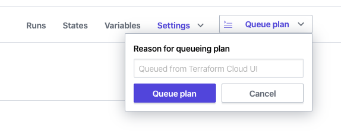

# Create Kubernetes cluster

The creation of the Kubernetes cluster will be done from Terraform Cloud. The workspace configured in the previous section will create the infrastructure from the existing code in the GitHub repository.

## Auto Apply in Terraform Cloud

Terraform Cloud has two ways of setting changes: Manual and Automatic.

For production environments it is advisable to use the Manual mode, in this way the other members of the team can analyze the changes and give their criteria.

However, the exercise to be performed at this time does not include this scenario, therefore, the changes will be configured automatically.

Access the settings of your workspace and select the `Auto apply` option.


## Create a cluster on Digital Ocean

The description of the Kubernetes cluster is in the `infra / cluster.tf` file.

```bash
cat infra/cluster.tf

# kubernetes cluster
resource "digitalocean_kubernetes_cluster" "staging" {
  name    = "staging"
  region  = "ams3"
  version = "1.16.6-do.0"
  tags    = ["staging"]

  node_pool {
    name       = "worker-pool"
    size       = "s-1vcpu-2gb"
    auto_scale = true
    min_nodes  = 2
    max_nodes  = 5
  }
}
```

To create the cluster use the `Queue plan` button located above and to the right of the Terraform platform.



Once the plan is started, you can see on your screen how the Terraform changes are applied. This action may take about 7 minutes.


Access the Kubernetes section in Digital Ocean and note that a cluster of Kubernetes with the name `staging` has been started.


Wait for the cluster to be created to perform the next step.

## Access the cluster from Kubectl

Once the cluster is created, it is necessary to be able to access it from the `kubectl` tool. To achieve this, you will need to obtain the credentials of the new cluster, as well as the URL to access the Kubernetes API.

Use the following command to configure the `~/.kube/config` file with the credentials of the Digital Ocean cluster:

```bash
doctl kubernetes cluster kubeconfig save staging

Notice: adding cluster credentials to kubeconfig file found in "/Users/......./.kube/config"
Notice: setting current-context to do-ams3-staging
```

Verify that the configuration was successful. List the cluster nodes:

```bash
kubectl get nodes

NAME               STATUS   ROLES    AGE     VERSION
worker-pool-0uc4   Ready    <none>   4m43s   v1.16.6
worker-pool-0uch   Ready    <none>   5m38s   v1.16.6
```

Next: [Install Flux CD](06-install-fluxcd.md)
